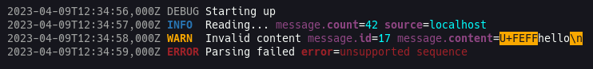

# Slug

Slug is a [`slog.Handler`] that writes human-readable logs.

⚠ Slug is still in early development and can be a bit unstable.

## Features

-   Colours!

-   Non-printable characters are escaped

## Non-Features

-   Performance

    Being fast or low on resources is not a goal

-   Predictable syntax

    The output is meant for human eyes only, not to be parsed

[`slog.Handler`]: https://pkg.go.dev/log/slog#Handler
